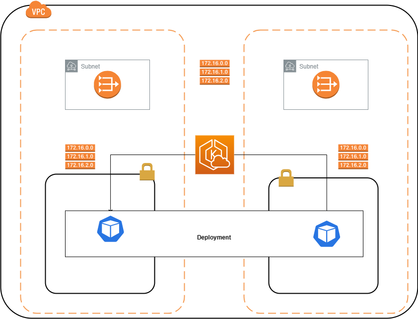

# Project Terraform Infrastructure for AWS VPC and EKS Cluster and deploying aspent-mssql app 

## Overview

This project demonstrates the usage of Terraform to create an AWS Virtual Private Cloud (VPC) with two public subnets, two private subnets, and three route tables. Additionally, it deploys an Amazon Elastic Kubernetes Service (EKS) cluster with multi-container pods consisting of an application and a database.

## Prerequisites

Before you begin, ensure you have the following:

1. AWS CLI installed and configured with appropriate credentials.
2. Terraform CLI installed on your local machine.

## Project Structure

The project is structured as follows:

```
WIDEPOT-INTERN/
  ├── terraform/
  │    ├── provider.tf       
  │    ├── vpc.tf
  │    ├── eks.tf
  │    ├── subnets.tf
  │    ├── igw.tf
  │    ├── routeTables.tf
  │    ├── routeTableAssociation.tf
  │    ├── NATGWs.tf
  │    └── node_group.tf
  ├── aspnet-mssql
  ├── deployment.yaml      
  ├── README.md
          

```

- `terraform`: Contains Terraform configuration files for creating the VPC, subnets, route tables, and NAT gateways.
- `terraform/eks.tf`: Contains Terraform configuration files for creating the EKS cluster.
- `terraform/provider.tf`: The main Terraform configuration file that calls other modules.
- `deployment.yaml`: Kubernetes YAML file defining the deployment of the application and database in multi-container pods.
- `README.md`: The file you are currently reading.

## Deployment Steps

1. Clone the project repository to your local machine:

   ```
   git clone <repository-url>
   cd project-root
   ```

2. Navigate to the `terraform` directory:

   ```
   cd terraform
   ```

3. Initialize Terraform:

   ```
   terraform init
   ```

4. Review and set any required variables in the `terraform.tfvars` file or provide them through command-line flags.

5. Plan the Terraform deployment:

   ```
   terraform plan
   ```

6. Apply the Terraform configuration:

   ```
   terraform apply
   ```

7. After the VPC and EKS cluster have been successfully created, configure `kubectl` to interact with the EKS cluster:

   ```
   aws eks update-kubeconfig --name eks
   ```

8. Verify that you can connect to the EKS cluster:

   ```
   kubectl get nodes
   ```

9. Deploy the multi-container pods with the application and database:

   ```
   kubectl apply -f ../deployment.yaml
   ```


## Infrastructure




## Cleanup
To remove all resources created by Terraform, use the following command:

```
terraform destroy
```

**Note**: Be cautious when running `terraform destroy`, as it will delete all resources created in the AWS account, including the VPC and EKS cluster.

## Conclusion

I have successfully deployed a VPC with public and private subnets, route tables, NAT gateways, and an EKS cluster with multi-container pods for the application and database.
